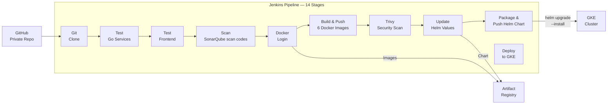

# TravelBooking — Full-Stack Microservices Travel Booking Platform

A cloud-native microservices-based travel booking application, deployed on Google Kubernetes Engine (GKE) with a complete DevOps lifecycle — Terraform, Helm, Jenkins CI/CD, Prometheus & Grafana monitoring, and HTTPS with Let's Encrypt.

---

## About the Project

TravelBooking is a cloud-native microservices travel application where users can search flights and hotels, make bookings, and process payments — similar to MakeMyTrip or Booking.com. The main focus of this project is to showcase a complete DevOps lifecycle on Google Cloud Platform.

🏗️ **Architecture** — The app is built using **microservices architecture** with 6 services — a React frontend and 5 Go backend services (user, search, booking, payment, notification). Data is stored in PostgreSQL with 5 separate databases (one per service), and Redis is used for caching search results.

☸️ **Kubernetes & Infrastructure** — Everything runs on **Google Kubernetes Engine (GKE)**. The GCP infrastructure (VPC, subnets, firewalls, Artifact Registry, static IP) is created using **Terraform** with state stored in Google Cloud Storage. The application is deployed using a custom **Helm chart** that creates all Kubernetes resources with one command.

⚙️ **CI/CD with Jenkins** — **Jenkins** runs inside the same GKE cluster and handles CI/CD. The 14-stage pipeline clones code from GitHub, tests services, builds and pushes Docker images to Artifact Registry, scans images with Trivy, packages the Helm chart, and deploys to GKE automatically.

📊 **Monitoring** — Set up with Prometheus, Grafana, and Alertmanager. Each service exposes metrics that Prometheus scrapes every 15 seconds. Grafana shows 6 custom dashboards, and Alertmanager fires alerts on pod failures, high CPU/memory, or HTTP errors.

🔒 **HTTPS & SSL** — Handled by cert-manager with Let's Encrypt. Free SSL certificates are issued automatically, and the Gateway terminates TLS. All HTTP traffic is permanently redirected to HTTPS, and certificates auto-renew every 60 days.

---

## Architecture Overview

## CI/CD Pipeline Flow (Jenkins)

---

## Tech Stack

| Layer | Technology |
|-------|-----------|
| **Frontend** | React.js 18, Tailwind CSS, Nginx |
| **Backend** | Go 1.21, Gin Framework, GORM |
| **Database** | PostgreSQL 15 (5 databases) |
| **Cache** | Redis 7 |
| **Container** | Docker (multi-stage builds) |
| **Orchestration** | Kubernetes (GKE) |
| **Kubernetes Management Platform** | Rancher |
| **Security - Vulnerability Scanner** | SonarQube, Trivy |
| **Infrastructure** | Terraform (modular) |
| **Packaging** | Helm Charts |
| **CI/CD** | Jenkins (on GKE) |
| **Monitoring** | Prometheus, Grafana, Alertmanager |
| **TLS/SSL** | cert-manager, Let's Encrypt |
| **Registry** | Google Artifact Registry |
| **Version Control** | GitHub (private) |

## Website

## Rancher

## Jenkins CI/CD

## SonarQube

## Grafana

